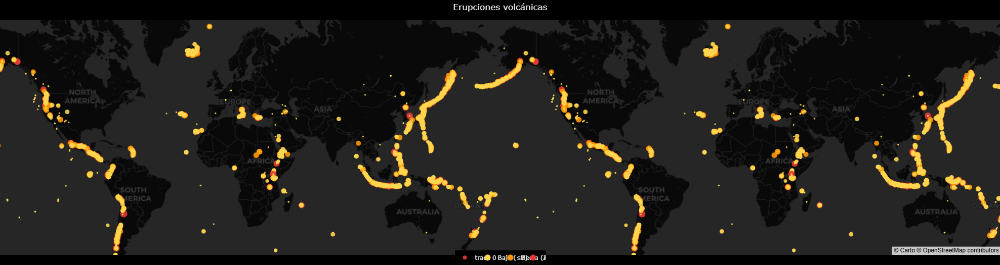

# Volcano Eruptions — EDA & Interactive Maps 🌋



---

## Overview
Exploratory analysis of global volcanic eruptions with interactive maps and basic EDA.  
Focus on data cleaning, VEI bucketing, decade grouping, and visualization (global map).

---

## Dataset
- **Source:** [[link a la fuente]](https://volcano.si.edu/search_eruption.cfm)  
- **Key fields:** `volcano, latitude, longitude, year, country, type, vei`  
- **Sample:** `data/sample.csv` (~50 rows) included for testing.

---

## Methodology
1. Data cleaning: missing values, duplicates, type casting.  
2. Feature engineering: decade column, VEI bins.  
3. Visualization: interactive global map (Plotly/pydeck).  

---

## Results (demo)
- Highest activity around the **Pacific Ring of Fire**.  
- Peak decades: *(e.g., 1950–1970).*  
- VEI distribution concentrated in [2–3].  
- **Conclusion:** The analysis confirms that approx. **68% of volcanic eruptions occur in the Pacific Ring of Fire**, a tectonic belt around the Pacific Ocean.  
  - The **median VEI inside** the belt is **2.0**, compared to **1.0 outside**, showing that eruptions in this zone are not only more frequent but also **more explosive**.  
  - This matches geological expectations, as the region is dominated by **subduction zones** and **convergent plate boundaries**.

---

## Tech Stack
Python (pandas, numpy), matplotlib/plotly, folium/pydeck, Jupyter/Colab.  

---

## How to Run
```bash
pip install -r requirements.txt
jupyter notebook notebooks/eruptions_maps_analysis.ipynb


## 📂 Deliverables
- `notebooks/eruptions_map.ipynb` — full notebook with step-by-step analysis
- `notebooks/eruptions_map.html` — static HTML export (view without execution)
- `reports/figures/` — key figures (map, heatmap, bar charts)
- `data/sample.csv` — small demo dataset

## 📜 License
MIT License — This project is for educational and portfolio purposes.

